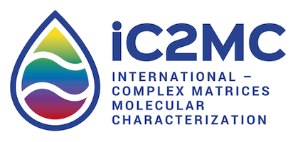

# iC2MC repository

C2MC is a joint laboratory created in 2014 based on two analytical groups from the universities of Pau and Rouen and the Analytical Platforms of TotalEnergies.

The addition of skills and synergies arising from these three groups is already generating a creative ambiance in cutting-edge research into the molecular characterization of complex matrices linked with Energy & Environment studies.

In 2019 C2MC became international with the participation of the research group of Ryan Rodgers (Maglab, Tallahassee). As a consequence, the new name of the joint lab is iC2MC.

## Softwares

The repositories provide source code and software developed in the scope of iC2MC.

* [PyC2MC_viewer](https://github.com/iC2MC/PyC2MC_viewer) 
* [PyC2MC](https://github.com/iC2MC/pyc2mc)

